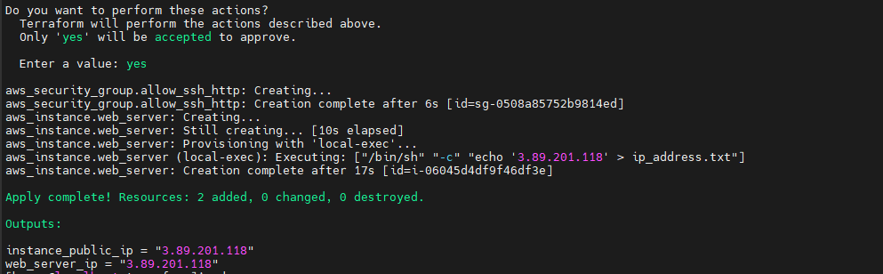
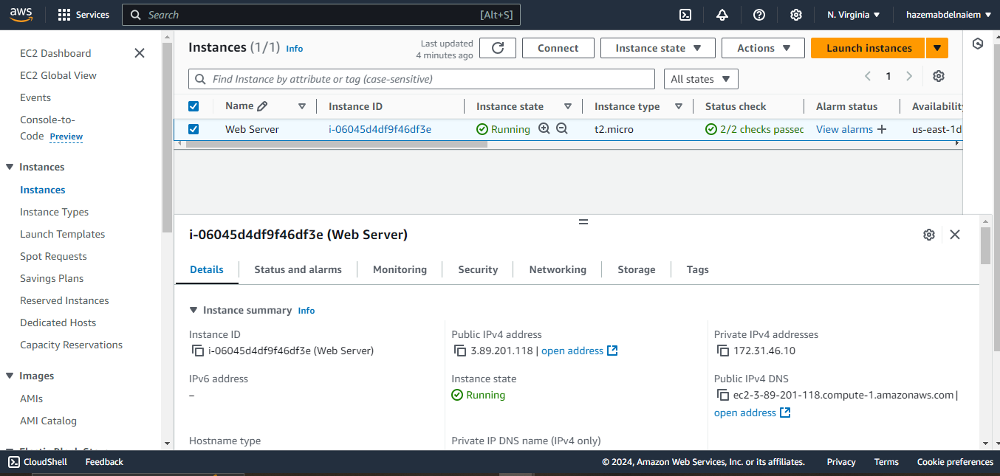
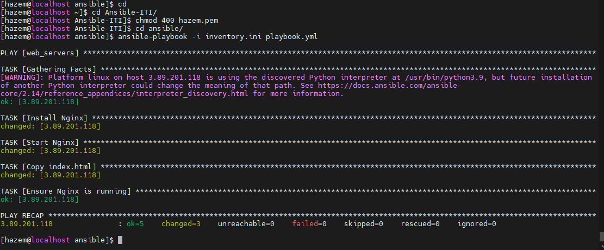

# Ansible Project ITI

## Overview
This project is designed to showcase infrastructure automation using **Ansible** and **Terraform**. It demonstrates how to manage server configurations and deployments with Ansible, while utilizing Terraform for infrastructure provisioning.

## Technologies
- **Ansible**: For automation of server configuration and application deployment.
- **Terraform**: To provision infrastructure across different cloud providers.

## screenshot 
 AWS Apply 
 


 Instances
 


 playbook
 


 webserver
 


## Installation
1. Clone the repository: 
   ```bash
   git clone https://github.com/hazem20/ansible-project-iti.git
   ```
2. Install Ansible and Terraform:
   - Ansible: [Ansible Installation Guide](https://docs.ansible.com/ansible/latest/installation_guide/index.html)
   - Terraform: [Terraform Installation Guide](https://learn.hashicorp.com/tutorials/terraform/install-cli)

## Setup
Configure your `inventory` and `playbook` in Ansible, and define your infrastructure in Terraform files. 

### Example Commands:
- Ansible Playbook execution:
  ```bash
  ansible-playbook -i inventory setup.yml
  ```
- Terraform deployment:
  ```bash
  terraform init
  terraform apply
  ```

## Usage
1. **Ansible**: Automate routine tasks like installing software, configuring servers, or managing users.
2. **Terraform**: Provision resources such as virtual machines, networks, and storage in a repeatable way.

## Contributions
Feel free to contribute by opening issues or submitting pull requests.
